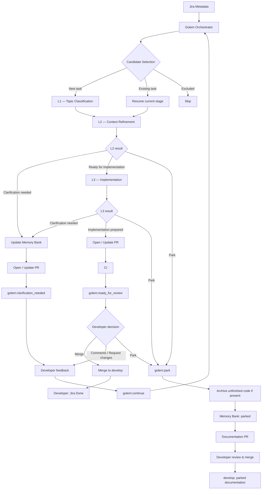

```mermaid
graph TD
    A["Jira Metadata"] --> B["Golem Orchestrator"]
    B --> C{"Candidate Selection"}

    C -->|New task| L1["L1 — Topic Classification"]
    C -->|Existing task| R["Resume current stage"]
    C -->|Excluded| X["Skip"]

    L1 --> L2["L2 — Context Refinement"]
    R --> L2

    L2 --> D{"L2 result"}
    D -->|Clarification needed| Q["Update Memory Bank"]
    Q --> PR1["Open / Update PR"]
    PR1 --> CL["golem:clarification_needed"]
    CL --> H["Developer feedback"]
    H --> CONT["golem:continue"]
    CONT --> B

    D -->|Ready for implementation| L3["L3 — Implementation"]
    L3 --> E{"L3 result"}

    E -->|Clarification needed| Q
    E -->|Implementation prepared| PR2["Open / Update PR"]
    PR2 --> CI["CI"]
    CI --> REVIEW["golem:ready_for_review"]

    REVIEW --> F{"Developer decision"}
    F -->|Merge| M["Merge to develop"]
    M --> DONE["Developer: Jira Done"]

    F -->|Comments / Request changes| H
    F -->|Park| PARK["golem:park"]

    D -->|Park| PARK
    E -->|Park| PARK

    PARK --> ARCHIVE["Archive unfinished code if present"]
    ARCHIVE --> MB["Memory Bank: parked"]
    MB --> DPR["Documentation PR"]
    DPR --> DM["Developer review & merge"]
    DM --> DP["develop: parked documentation"]
```
