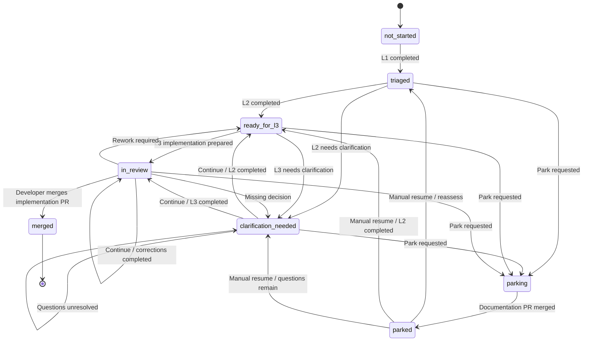

```mermaid
    stateDiagram-v2
    direction TB

    [*] --> not_started

    not_started --> triaged: L1 completed

    triaged --> ready_for_l3: L2 completed
    triaged --> clarification_needed: L2 needs clarification

    clarification_needed --> ready_for_l3: Continue / L2 completed
    clarification_needed --> in_review: Continue / L3 completed
    clarification_needed --> clarification_needed: Questions unresolved

    ready_for_l3 --> in_review: L3 implementation prepared
    ready_for_l3 --> clarification_needed: L3 needs clarification

    in_review --> in_review: Continue / corrections completed
    in_review --> clarification_needed: Missing decision
    in_review --> ready_for_l3: Rework required
    in_review --> merged: Developer merges implementation PR

    triaged --> parking: Park requested
    clarification_needed --> parking: Park requested
    ready_for_l3 --> parking: Park requested
    in_review --> parking: Park requested

    parking --> parked: Documentation PR merged

    parked --> triaged: Manual resume / reassess
    parked --> ready_for_l3: Manual resume / L2 completed
    parked --> clarification_needed: Manual resume / questions remain

    merged --> [*]
```
